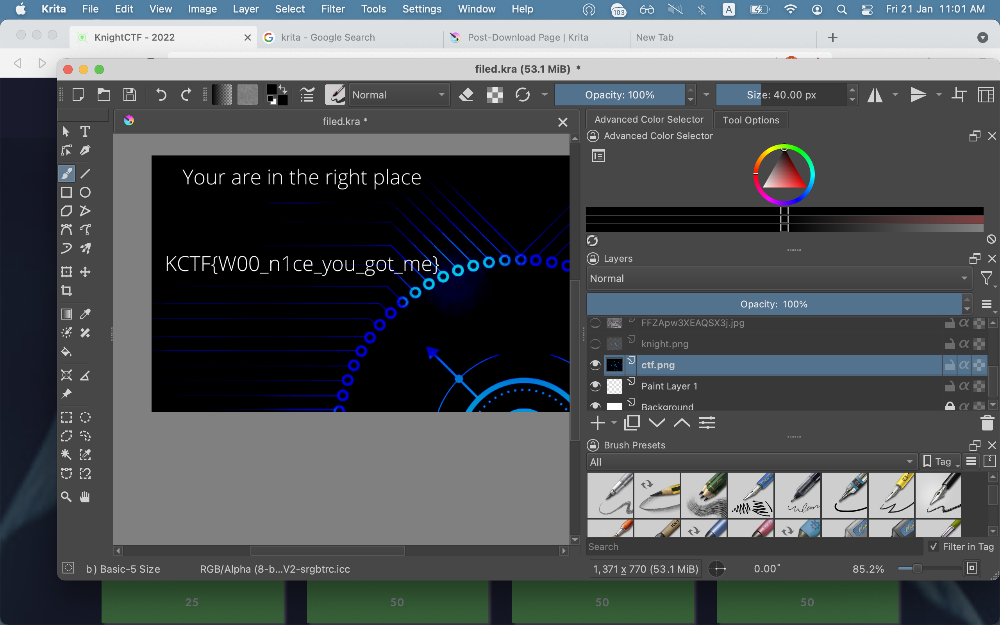
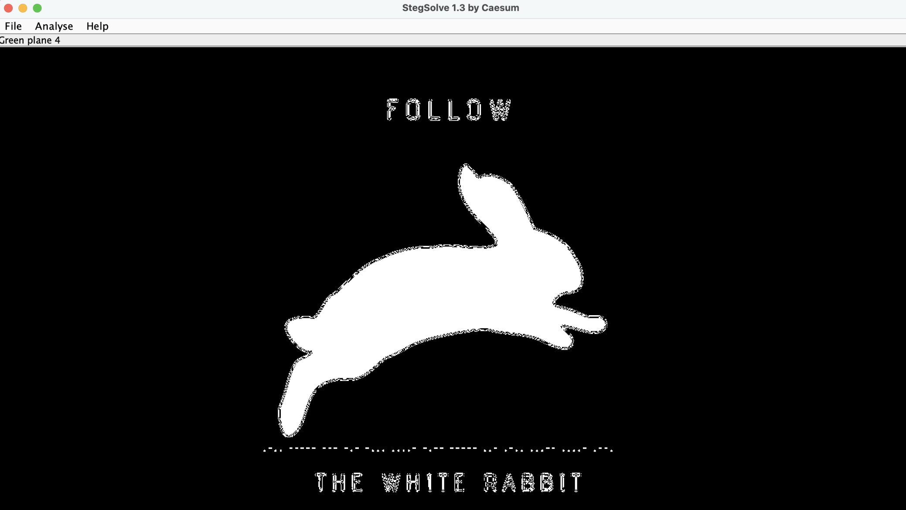

# KnightCTF 2022 – Stego Challenges

## Challenge 1: FileD (25 points)

There were a bunch of files given but most of them were unimportant. There was a `filed.kra` that was the largest file at around 17.2Mb which was interesting

Searching online showed that `krita`, a software for image editing (similar to Gimp) was used to open `.kra` files

### Solution

1. Download krita
2. Open file and remove layers until flag is found



### Flag

```
KCTF{W00_n1ce_you_got_me}
```

## Challenge 2: Follow the White Rabbit (25 points)

We are given a jpeg of a white rabbit

### Solution

1. Open the image in `stegsolve` and iterate through filters until morse code is found
2. Decode morse code for flag



### Flag

```
KCTF{L0OKB4Y0UL34P}
```

## Challenge 3: QR Code from the Future (100 points)

A gif of flashing QRs is given.

### Solution

1. Opening the `gif` as a pdf showed the different frames
2. Scanning each frame gives a character, when put together will give the flag
- I created a snipet of code that takes the frames and print the string :
```python
import  cv2, os

def do(file) : 
    filename = file
    image = cv2.imread(filename)
    detector = cv2.QRCodeDetector()
    data, vertices_array, binary_qrcode = detector.detectAndDecode(image)
    if vertices_array is not None:
          print(data , end="")
    else:
          print("There was some error") 

if __name__=="__main__" : 
    path="you path to frames"
    os.chdir(path)
    files = os.listdir(path)
    i = 0 
    for file in files : 
        os.rename(file , path + str(i) + '.png')
        do(path + str(i) + '.png')
        i+=1
```

The result was : }pvznalq_bg_pvgngf_zbes_qriybir_gbt_rqbp_ED{SGPX
Reverse it and rot 13 
### Flag

```
KCTF{QR_code_got_evolved_from_static_to_dynamic}
```
