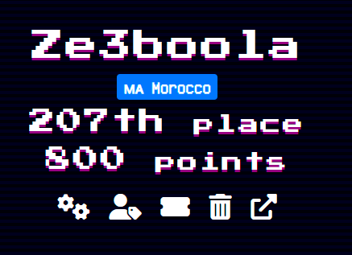

# SEE CTF 2022 
Organised by **Social Engineering Experts CTF team**

### Challenges  :
> | Name        | Category    | Level |
> | ----------- | ----------- | ------- |
> | [Super Secure Requests Forwarder](./Web/README.md#super-secure-requests-forwarder) | web |easy |
> | [Sourceless Guessy Web (Baby Flag)](./Web/README.md#super-secure-requests-forwarder) | web |easy |
> | [Flag Portal (Flag 1)](./Web/README.md#flag-portal-flag-1) | web |meduim |
> | [Sourceless Guessy Web (RCE Flag)](./Web/README.md#sourceless-guessy-web-rce-flag) | web |medium |

Challenges Source Code: [Link](https://github.com/zeyu2001/My-CTF-Challenges/tree/main/SEETF-2022)

Team : **Ze3boola**

Rank : **207th / 740**

 