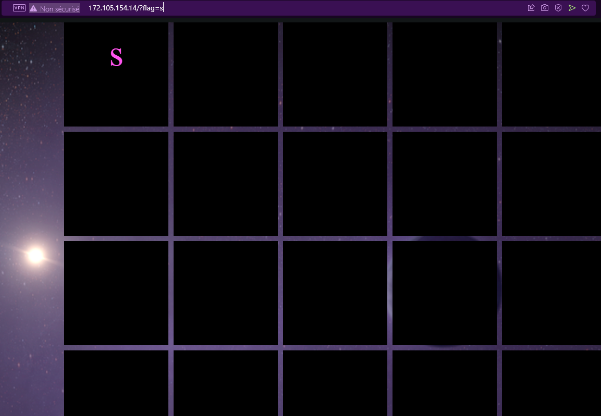
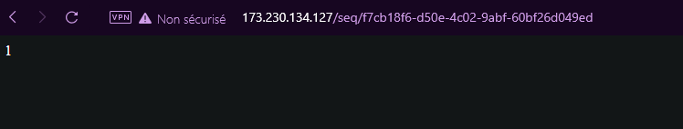

# Space Heroes CTF 2022 - Web 
## 1- Flag in space

#### about : 
- Type: Web 
- Level: easy 
- Points : 100
- Website : http://172.105.154.14/
</br>

if we open The URL with a standard browser we got redirected to : http://172.105.154.14/?flag=s

<center></img></center>

The idea is clear to go :) , we bruteforce , easy peasy , i created a script in python to do it automatically 

```python
import requests
from string import ascii_letters

letters = ascii_letters.lower() + "".join([str(i) for i in range(10)]) + "_-;"+ascii_letters.upper() 

headers = {
    'Connection': 'keep-alive',
    'Upgrade-Insecure-Requests': '1',
    'User-Agent': 'Mozilla/5.0 (Windows NT 10.0; Win64; x64) AppleWebKit/537.36 (KHTML, like Gecko) Chrome/98.0.4758.109 Safari/537.36 OPR/84.0.4316.52',
    'Accept': 'text/html,application/xhtml+xml,application/xml;q=0.9,image/avif,image/webp,image/apng,*/*;q=0.8,application/signed-exchange;v=b3;q=0.9',
    'Accept-Language': 'fr-FR,fr;q=0.9,en-US;q=0.8,en;q=0.7',
}
def check(flag , p ,text) : 
    temp = "<div>\n\n{}\n\n</div>"
    s = ""
    for i in flag : 
        s += temp.format(i) + "\n"
    s += temp.format(p)
    if s in text : 
        return True 
    return False 

flag = "shctf{2"
temp = "<div>\n\n{}\n\n</div>"
found = True 
while found : 
    found = False
    for i in letters : 
        response = requests.get('http://172.105.154.14/?flag='+flag+i, headers=headers, verify=False)
        if check(flag , i  , response.text) : 
            flag += i
            print("found : " , flag)
            found = True
            break
    if n == len(letters)-1 : 
        print("Error")
        exit(0)
```

flag : **shctf{2_explor3_fronti3r}**

## 2- Mysterious Broadcast

#### about : 
- Type: Web 
- Level: easy 
- Points : 100
- Website : http://173.230.134.127/

when we visit the url it create a seq token , and every refresh a bit appears : 

<center></img></center>

let's try to get all the bits : 

```python
import requests

headers = {
    'Connection': 'keep-alive',
    'Upgrade-Insecure-Requests': '1',
    'User-Agent': 'Mozilla/5.0 (Windows NT 10.0; Win64; x64) AppleWebKit/537.36 (KHTML, like Gecko) Chrome/98.0.4758.109 Safari/537.36 OPR/84.0.4316.52',
    'Accept': 'text/html,application/xhtml+xml,application/xml;q=0.9,image/avif,image/webp,image/apng,*/*;q=0.8,application/signed-exchange;v=b3;q=0.9',
    'Accept-Language': 'fr-FR,fr;q=0.9,en-US;q=0.8,en;q=0.7',
}
def getbytes() : 
    flag = ""
    hash = "ea2e0a36-e485-4c4e-a1e2-3895f1f6bff9"
    while True : 
        response = requests.get('http://173.230.134.127/seq/'+hash, headers=headers, verify=False)
        data = response.text
        flag += data
        print("flag :" , flag)
        if data == "": 
            break 
```

result : 
> 1100011011001011010001101010110010010001111011010011011110100011011000100111011010101100001101011111011001001010110001101100001000101011001110100011101101110110001100001010101011001110100101101000110001011011011010010110100011000111101101101001001110011000011110011101111010111101

in the description there is the line : 
> There used to be 8 Models of humanoid cylon but now there are only 7. We’ve located one of their broadcast nodes but we can’t decode it. Are you able to decipher their technologies?

so instead of coding a characeter in 8 bits we can code it in 7 (since they are all under 256 in ascii code)

```python
def get_flag() : 
    serie="1100011011001011010001101010110010010001111011010011011110100011011000100111011010101100001101011111011001001010110001101100001000101011001110100011101101110110001100001010101011001110100101101000110001011011011010010110100011000111101101101001001110011000011110011101111010111101"
    for i in range( 0 , len(serie) ,7) : 
        s = serie[i:i+7]
        print(chr(int(s, 2)) , end="")
```
result : **c2hjdGZ7QXNjaWlJc0E3Qml0U3RhbmRhcmR9Cg==**

it's base64 , convert it : 

flag : **shctf{AsciiIsA7BitStandard}**

## 3- R2D2

#### about : 
- Type: Web 
- Level: easy 
- Points : 100
- Website : http://173.230.138.139
</br>

if we vieuw the source code : 

```html
<html>

<h1>Roger, Roger</h1>


<h4>No, you are the one who is useless.</h4>

</html>
```
First idea to come in mind is the **robots.txt** , a file that block google SEO to search certain content 

flag : **shctf{th1s-aster0id-1$-n0t-3ntir3ly-stable}**

## 4- Space Traveller

#### about : 
- Type: Web 
- Level: easy 
- Points : 100
- Website : https://spaceheroes-web-explore.chals.io
</br>

a look in the source code reveals a javascript obfuscated code : 

```js
var _0xb645 = ["\x47\x75\x65\x73\x73\x20\x54\x68\x65\x20\x46\x6C\x61\x67", "\x73\x68\x63\x74\x66\x7B\x66\x6C\x61\x67\x7D", "\x59\x6F\x75\x20\x67\x75\x65\x73\x73\x65\x64\x20\x72\x69\x67\x68\x74\x2E", "\x73\x68\x63\x74\x66\x7B\x65\x69\x67\x68\x74\x79\x5F\x73\x65\x76\x65\x6E\x5F\x74\x68\x6F\x75\x73\x61\x6E\x64\x5F\x6D\x69\x6C\x6C\x69\x6F\x6E\x5F\x73\x75\x6E\x73\x7D", "\x59\x6F\x75\x20\x67\x75\x65\x73\x73\x65\x64\x20\x77\x72\x6F\x6E\x67\x2E", "\x69\x6E\x6E\x65\x72\x48\x54\x4D\x4C", "\x64\x65\x6D\x6F", "\x67\x65\x74\x45\x6C\x65\x6D\x65\x6E\x74\x42\x79\x49\x64"];

function myFunction() {
    let _0xb729x2;
    let _0xb729x3 = prompt(_0xb645[0], _0xb645[1]);
    switch (_0xb729x3) {
        case _0xb645[3]:
            _0xb729x2 = _0xb645[2];
            break;
        default:
            _0xb729x2 = _0xb645[4]
    };
    document[_0xb645[7]](_0xb645[6])[_0xb645[5]] = _0xb729x2
}
```
you just have to put the **_0xb645** in a browser console to decode into : 

```js
['Guess The Flag', 'shctf{flag}', 'You guessed right.', 'shctf{eighty_seven_thousand_million_suns}', 'You guessed wrong.', 'innerHTML', 'demo', 'getElementById']
```

flag easy :) : **shctf{eighty_seven_thousand_million_suns}**