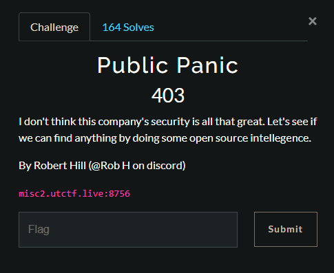
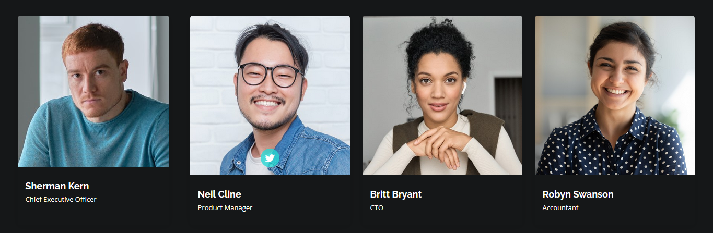
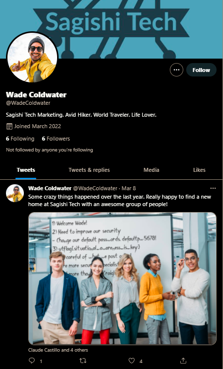
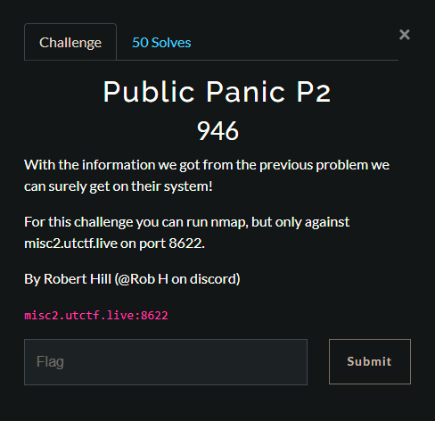

# UTCTF 2022 - Misc
## 1- Public Panic 1 :
<center></img></center>

#### about : 
- Type: Web 
- Level: easy 
- Website : http://misc2.utctf.live:8756

After visiting the website i found the twitter account of the members of the company

<center></img></center>

i tried to look for other stuff memebers in twitter and i found **Wade Coldwater** , who posted an image : 

<center></img></center>

in which we can see the flag : **utflag{situational_awareness_is_key}**

and a password : defaultpw5678

## 2- Public Panic 2 : 

<center></img></center>

#### about : 
- Type: Web 
- Level: easy 
- Website : http://misc2.utctf.live:8622

we can only run nmap against port **8622**

we found it's ssh , and since we found a password **defaultpw5678** , we only need to know the user to get in , i tried all memebers of the company but didn't work , so i thought they changed the format , i created a list of possible formats : 

```
name # kern           
Name # Kern
lastname # sherman
Lastname # Sherman
firstletterofnameLastname # kSherman
firstletteroflastnameName # sKern
firstletterofnamelastname # ksherman
firstletteroflastnamename # skern
NameLastname # KernSherman
namelastname # kersherman
nameLastname # kernSherman
Namelastname # Kernsherman
Name_Lastname # Kern_Sherman
name_lastname # kern_sherman
name_Lastname # kern_Sherman
Name_lastname # Kern_sherman
Name.Lastname # Kern.Sherman
name.lastname # kern.sherman
name.Lastname # kern.Sherman
Name.lastname # Kern.sherman
LastnameName # ShermanKern
lastnamename # shermankern
lastnameName # shermanKern
Lastnamename # Shermankern
Lastname_Name # Sherman_Kern
lastname_name # sherman_kern
lastname_Name # sherman_Kern
Lastname_name # Sherman_kern
Lastname.Name # Sherman.Kern
lastname.name # sherman.kern
Lastname.name # Sherman.kern
lastname.Name # sherman.Kern
```

and then run hydra against it , result : cshackleford:defaultpw5678!

flag : **utflag{conventions_knowledge_for_the_win}**