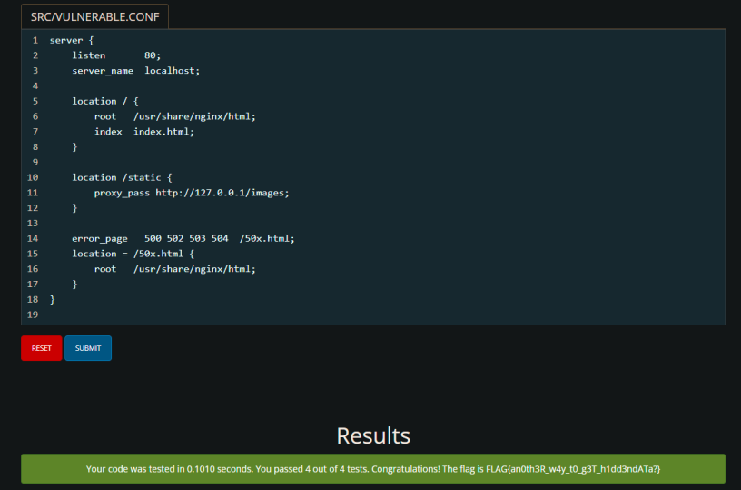
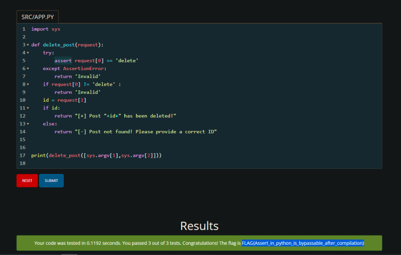
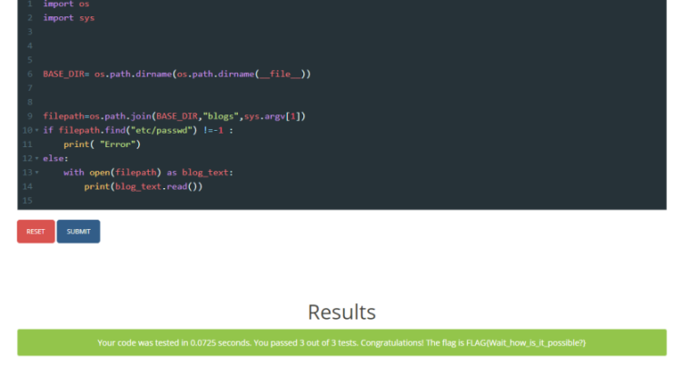

# ZainCTF 2022 - Web 
## 1- ing1nx

#### about : 
- Type: Secure Coding 
- Level: easy 
- points: 50

nginx is known for its famous misconfiguration , you just need to change  : 
> proxy_pass http://127.0.0.1/images/ -> proxy_pass http://127.0.0.1/images 

 
the issue is if we request http://127.0.0.1/static../../../../etc/passwd , the browser will send it will be intrepreted as http://127.0.0.1/images/../../../../etc/passwd which will be after that /etc/passwd local file inclusion.

</img>

## 2- Haevde 

#### about : 
- Type: Secure Coding 
- Level: medium
- points: 100 

Here is a [meduim](https://infosecwriteups.com/how-assertions-can-get-you-hacked-da22c84fb8f6) that explains why using asserts in python is dangerous , so we added an if else to do the same as assert and we got the flag

</img>

## 3- Paff 

#### about : 
- Type: Secure Coding 
- Level: medium
- points: 100 

Actually this one was like lady luck has smiled , so what i did , i just change the check for any '.' to 'etc/passwd' and it worked , pretty easy because i am lucky :) : 

</img>

